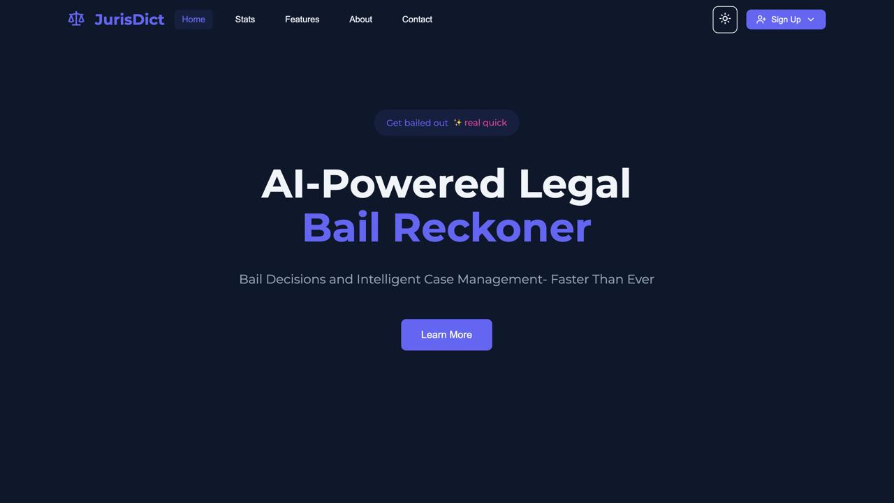
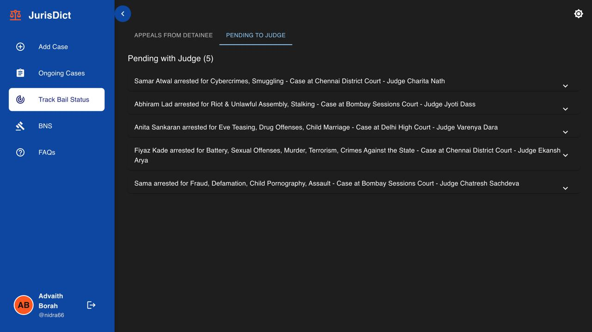
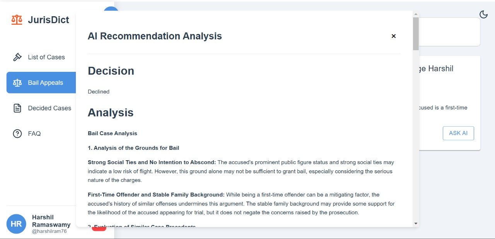
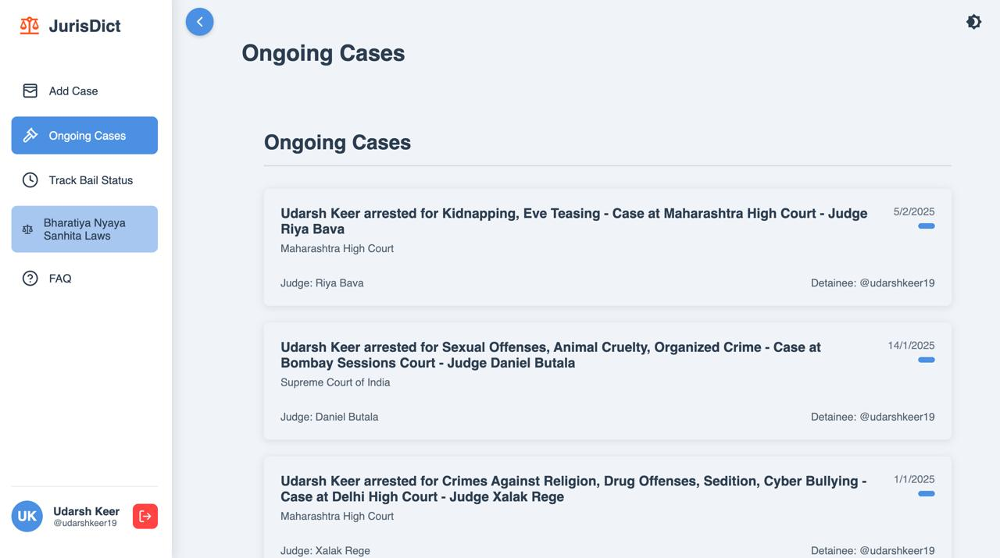

# JurisDict - AI-Powered Bail Reckoner & Case Management System

🚀 **JurisDict** is an advanced AI-powered platform designed to streamline the bail process and enhance case management for **lawyers**, **judges**, and **detainees**. By leveraging cutting-edge AI techniques, JurisDict predicts bail outcomes, automates legal workflows, and provides real-time case tracking, making the legal process faster, more efficient, and accessible.

---

## 🌟 Key Features

### 🧠 **AI-Powered Bail Outcome Prediction**
- Predicts bail outcomes with **95% accuracy** using advanced machine learning models.
- Helps lawyers and judges make informed decisions quickly.

### 📄 **Document Automation**
- Generates legal documents in seconds using smart templates.
- Reduces manual effort and ensures compliance with legal standards.

### ⏰ **Case Tracking & Deadline Management**
- Real-time updates on case progress.
- Automated reminders for important deadlines.

### 👥 **Role-Based Dashboards**
- Tailored dashboards for **lawyers**, **judges**, and **detainees**.
- Easy access to case details, bail predictions, and legal documents.

### 🔒 **Secure & Confidential**
- End-to-end encryption ensures data privacy and security.
- Role-based access control for sensitive information.

---

## 🖥️ Landing Page

The **Landing Page** introduces JurisDict and its features. It includes:
- A hero section highlighting the AI-powered bail reckoner.
- Stats showcasing the platform's accuracy and impact.
- Core features explained with icons and descriptions.

  

---

## 🔑 Login & Signup Pages

### 🚪 **Login Page**
- Secure login for **lawyers**, **judges**, and **detainees**.
- Role-based authentication for personalized dashboards.

### 📝 **Signup Page**
- Easy registration process for new users.
- Role selection during signup (Lawyer, Judge, Detainee).

---

## 🏠 Dashboards

### 👨‍💼 **Lawyer Dashboard**
- View assigned cases and bail predictions.
- Access legal documents and case history.
- Track deadlines and court dates.

  

### 👩‍⚖️ **Judge Dashboard**
- Review bail applications and predictions.
- Manage case schedules and rulings.
- Access historical case data for reference.

  

### 🔗 **Detainee Dashboard**
- Track bail application status.
- View case details and predicted outcomes.
- Communicate with assigned lawyers.

  

---

## 🛠️ Technologies Used

- **Frontend**: React.js, Framer Motion , Lucide Icons.
- **Backend**: Node.js, Express.js.
- **Database**: MongoDB.
- **AI/ML**: Python, TensorFlow, Scikit-learn, Gemini API.
- **Authentication**: JWT (JSON Web Tokens).
- **Styling**: Tailwind CSS.
- **Deployment**: Cloudflare, Render.
